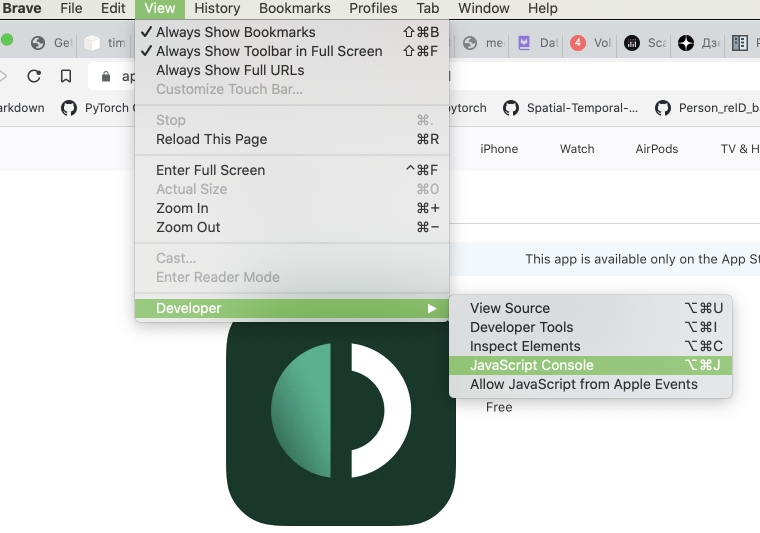

# ShadowSocks Installation  
Shadowsocks is a powerfull lightweight VPN solution that is quite hard to identify.  
[Official site](https://shadowsocks.org/)  
[Source code for shadowsocks](https://github.com/shadowsocks/shadowsocks-libev)  

## Server-side installation via docker compose  

Get yourself a decent linux box at some cloud provider where internet is not blocked.  
Install docker and create a `docker-compose.yml` file.  

```yaml
version: "3.2"
services:
  shadowsocks:
    image: shadowsocks/shadowsocks-libev
    ports:
      - "8388:8388/tcp"
      - "8388:8388/udp"
    environment:
      - METHOD=aes-256-gcm
      - PASSWORD=<specify password here - you will use it to connect to server>
      - TIMEOUT=60
      - ARGS=--fast-open
    restart: always
```
You can also change the port to mimic HTTPS traffic. 
In this case the section with ports in `docker-compose` would look this:  
```
    ports:
      - "443:8388/tcp"
      - "443:8388/udp"
```

Now fire `docker-compose up -d` and you are done with serverside installation. 

## Client setup  

### Android  
Install an [application](https://play.google.com/store/apps/details?id=com.github.shadowsocks)  
Provide server address, port and method (aes-256-gcm)  
You are done.

### Server URI  
For apple devices outline app accepts a link with full details specification:  
`ss://method:password@hostname:port`  
Just one link and no need to fill in all the details.  
You need to encode the link with BASE64 method.  

For example, you have a server at `myserver.com:8888` using `aes-256-gcm` encryption method and password `FatPet123$`  
Then, with the plain URI `ss://aes-256-gcm:FatPet123$@myserver.com:8888`, you can generate the BASE64 encoded URI.  

To do so open JavaScript console in Chrome/Brave browser : menu View->Developer->JavaScript Console


Paste the line below:  
console.log( "ss://" + btoa("ss://aes-256-gcm:FatPet123$@myserver.com:8888") )   
Press `Enter`.  
You get an output like this:    
`ss://c3M6Ly9hZXMtMjU2LWdjbTpGYXRQZXQxMjMkQG15c2VydmVyLmNvbTo4ODg4`  - this is your BASE64-encoded URI.  

To help organize and identify these URIs, you can append a tag after the BASE64 encoded string:
`ss://c3M6Ly9hZXMtMjU2LWdjbTpGYXRQZXQxMjMkQG15c2VydmVyLmNvbTo4ODg4#My-awesome-VPN-server`  


### MacOS  
Install [app](https://apps.apple.com/ru/app/outline-secure-internet-access/id1356178125?mt=12)  
Paste the URI generated above.

### iOS  
Instal [app](https://apps.apple.com/us/app/outline-app/id1356177741)  
Paste the URI generated above.

Enjoy free internet and share it with your close-ones.  


